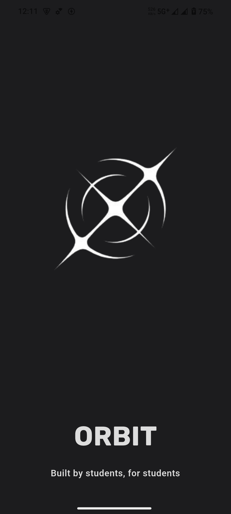
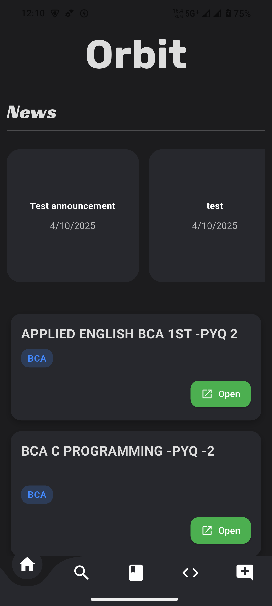
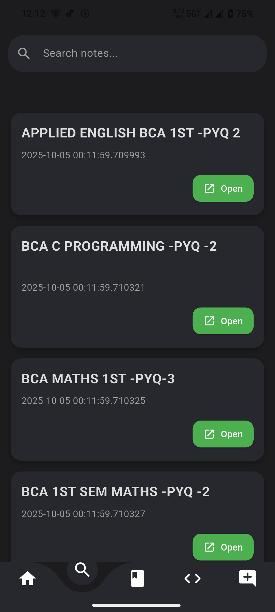
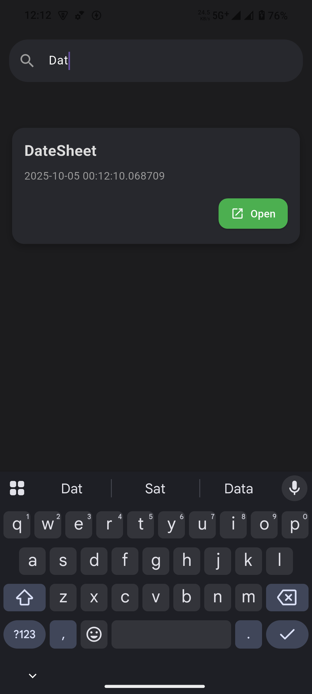
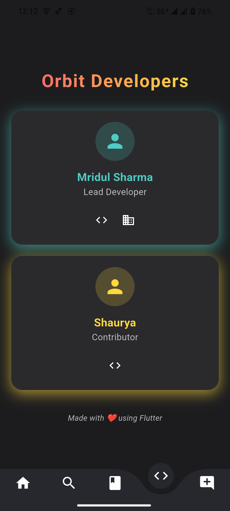

# ORBIT 📚✨

*Made by students, for students*

ORBIT is a Flutter-based mobile application designed to simplify **resource sharing, searching, and managing documents** in a college environment.
It provides students and administrators with an easy way to upload, access, and search for academic resources.

---

## 🚀 Features

* **Splash Screen** with smooth animations
* **Home Screen** with clean UI for navigation
* **Search Section** – find documents by title instantly
* **Search Results Page** – displays matching resources
* **Resource Upload Page** – upload new documents for all users
* **Admin Upload Page** – special uploader view for admins
* **About Developer Page** – details about the creators and contributors

---

## 📸 Screenshots

<p align="center">
    
    
  
</p>

<p align="center">
    
    
  
</p>

<p align="center">
  
</p>

---

## 🛠️ Tech Stack

* **Flutter** (Frontend)
* **Dart** (Programming Language)
* **Supabase** (Database)
* **Firebase** (Auth)

---

## 📦 Installation

1. Clone the repository

   ```bash
   git clone https://github.com/MridulSharma2552007/Orbit.git
   cd Orbit
   ```

2. Install dependencies

   ```bash
   flutter pub get
   ```

3. Run the app

   ```bash
   flutter run
   ```

4. Build release APK

   ```bash
   flutter build apk --release
   ```

---

## 👨‍💻 Developers

* **Mridul Sharma** – Lead Developer

  * [GitHub](https://github.com/MridulSharma2552007)
  * [LinkedIn](https://www.linkedin.com/in/mridul-sharma-a48604319/)

* **Shaurya** – Contributor

  * [GitHub](https://github.com/Shaurya0987)

---

## 📜 License

This project is licensed under the MIT License – feel free to use and improve it.

---
---

## 📱 Download the App

<p align="center">
  <a href="app-release.apk" download>
    
  </a>
</p>

> Click the button above to download the latest **release APK** and try out Orbit on your Android device!

---

⭐ If you like this project, give it a star on GitHub!
